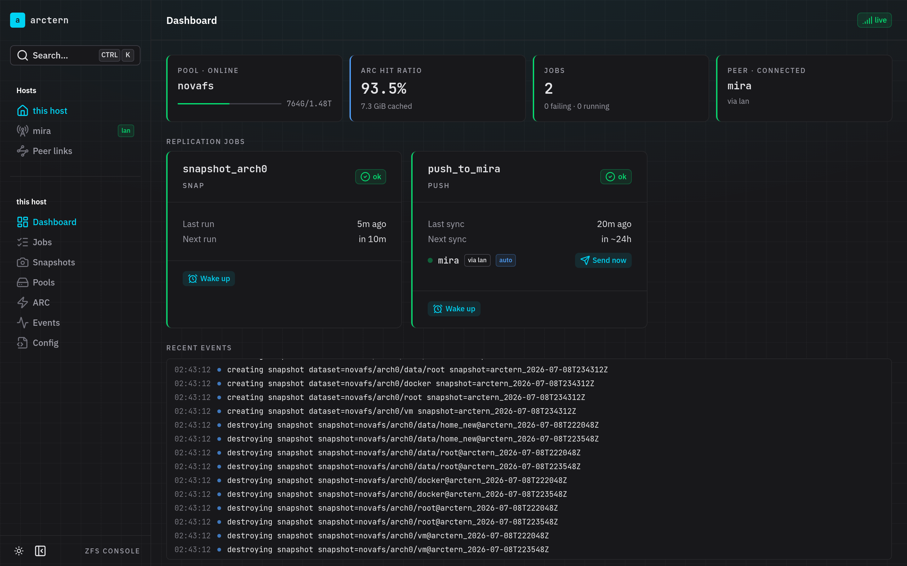
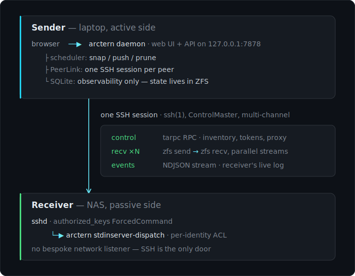
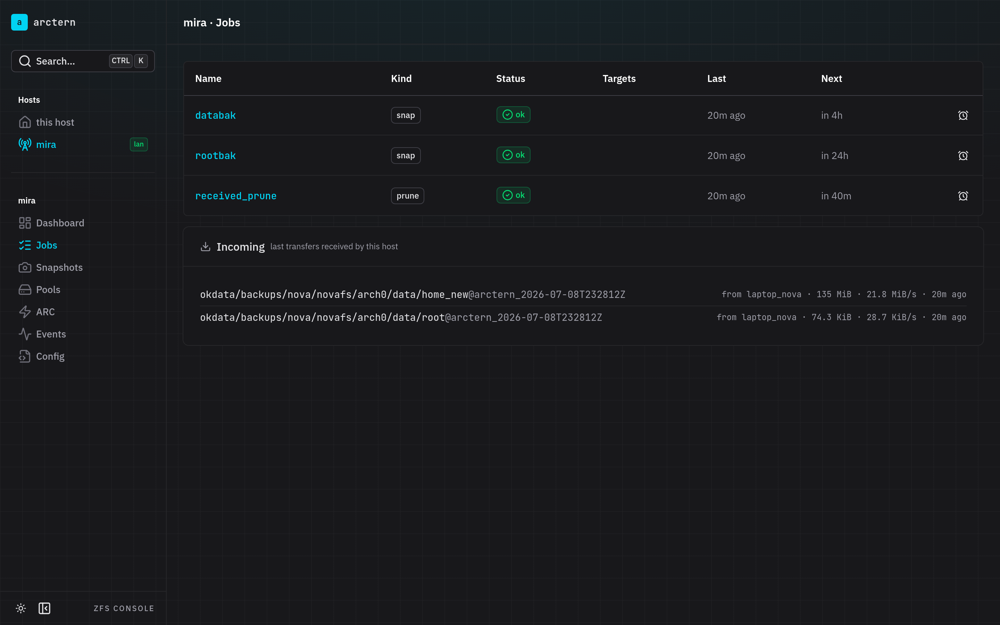
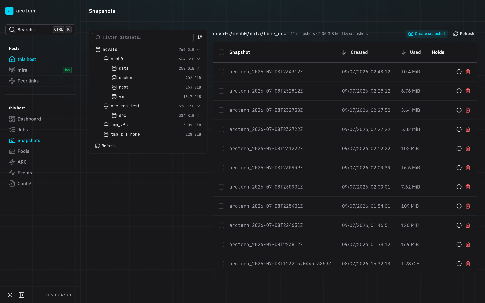
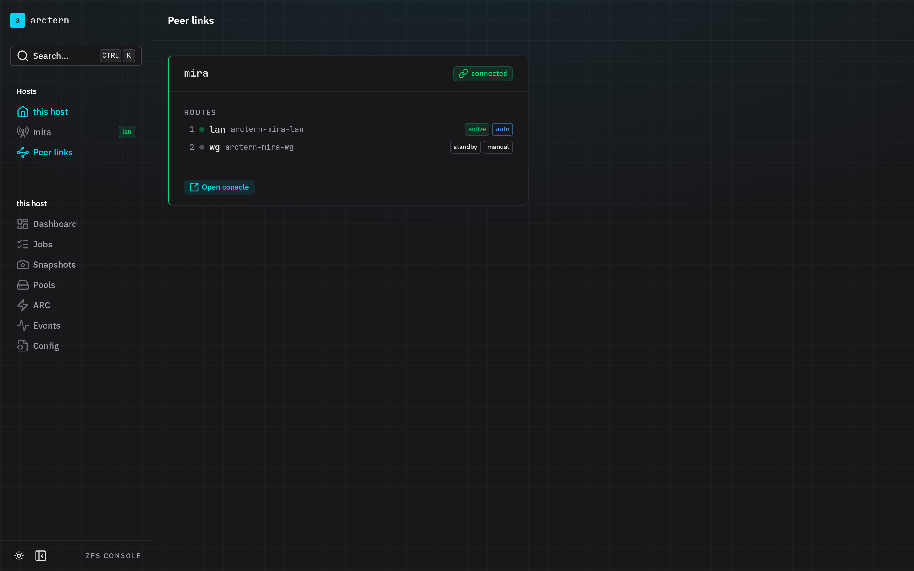
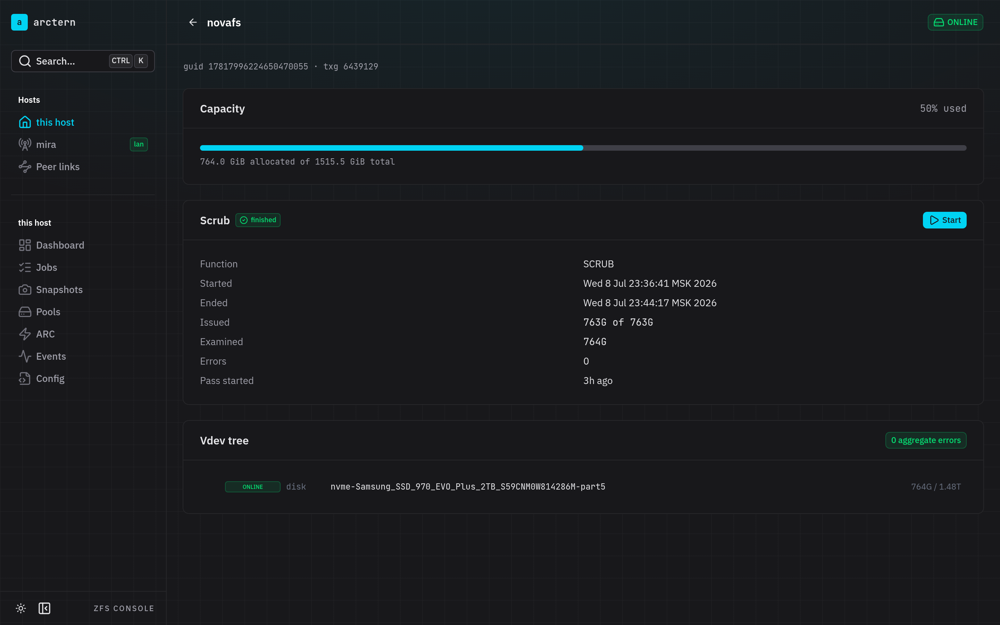
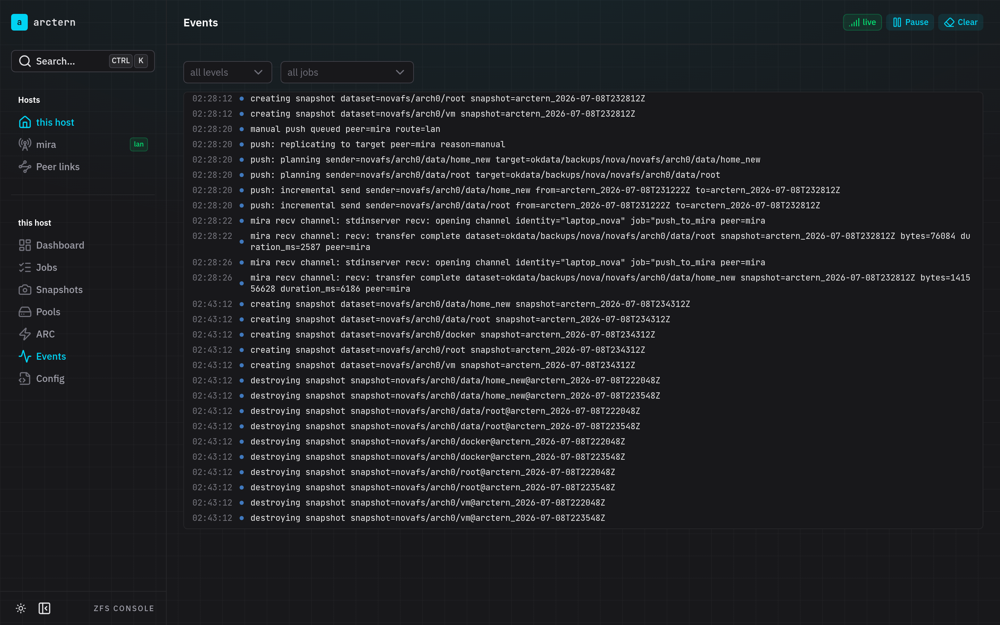

<h1 align="center">
  <picture>
    <source media="(prefers-color-scheme: dark)" srcset="docs/diagrams/tern-dark.svg">
    
  </picture>
  arctern
</h1>

<p align="center">Push-based ZFS replication over SSH — with a web console for <em>both</em> ends of the link.</p>

<p align="center">
  <a href="https://github.com/okhsunrog/arctern/actions/workflows/ci.yml"></a>
  <a href="https://github.com/okhsunrog/arctern/releases/latest"></a>
  <a href="LICENSE"></a>
  
</p>



> **Status:** in production — arctern replaced zrepl for the author's
> laptop→NAS backups and ships as static binaries. The design is settled
> ([`ARCHITECTURE.md`](ARCHITECTURE.md)); pre-1.0 only in the sense that
> the TOML config schema and HTTP API may still change between releases.

## What it is

arctern replicates ZFS datasets from an **active sender** (a laptop or
workstation that holds the data) to one or more **passive receivers** (a home
NAS that stores backups). Replication is **push-only**: the sender runs the
scheduler, decides what to send, and drives every transfer.

It is heavily inspired by [zrepl](https://zrepl.github.io/) — same snapshot
naming idiom (`<prefix><RFC3339-utc>`), same grid retention, same hold/cursor
discipline — but built as a single Rust binary with an embedded web console
that treats the peer as a first-class host, not a footnote.

## How it works

<p align="center">
  
</p>

- **Transport is plain SSH.** arctern drives the system `ssh(1)` via the
  [`openssh`](https://docs.rs/openssh) crate, so it inherits `~/.ssh/config`,
  the agent, hardware tokens, `ProxyJump`, and `ControlMaster` for free. One
  SSH session per peer multiplexes a long-lived **control** channel (tarpc RPC:
  receiver snapshot inventory, resume tokens, liveness, API proxy), short-lived
  **recv** channels (one per `zfs send | zfs recv` pipe, up to `parallel = N`
  at once), and a one-way **events** stream (the receiver's live log).
- **The receiver exposes no service of its own.** It needs `sshd`, the
  `arctern` binary on `PATH`, and an `authorized_keys` entry whose
  `ForcedCommand` runs `arctern stdinserver-dispatch <identity>`. A
  per-identity ACL in its config decides which jobs and operations that key may
  use and confines `recv` to a dataset subtree.
- **State lives in ZFS, not in arctern.** Holds, cursor bookmarks, and
  `receive_resume_token` are the source of truth; the scheduler is stateless
  and re-derives each plan from ZFS every cycle. A per-host SQLite database is
  observability only (job history, event log, received transfers, ARC stats).
- **One console, every host.** The sender's daemon serves the UI on loopback
  and proxies the peer's local API over the SSH control channel. Switching to a
  peer in the sidebar gives you the *same* console — jobs, snapshots, pools,
  events — scoped to that host, without the receiver exposing anything to the
  network.

## The console

**A peer is the same console, scoped to that host.** Below: the receiver's
jobs viewed from the sender, including what it received and how fast
("Incoming" is recorded by the receiver's own recv channels):



**Snapshots answer "what eats my space"** — dataset tree with sizes,
per-snapshot `used`, holds, create/destroy right there:



**Multi-path peers.** One peer = one physical host with prioritized routes;
the link picks the best reachable route and re-ranks automatically. A route
marked `auto = false` (say, metered WireGuard) still carries manual
"Send now" pushes but never auto-replicates — "auto at home, manual on the
road" without any network-detection config:



**Pools and events** round it out — scrub control, vdev tree with error
counters, and a live structured event feed (both hosts' events, bridged over
SSH):

|  |  |
|---|---|

## Features

- **Job types:** `snap` (periodic snapshots), `push` (replicate to peers),
  `prune` (receiver-side retention).
- **Grid retention** (`4x15m | 24x1h | 14x1d`) with the zrepl idiom of
  protecting non-prefixed (manual) snapshots by default.
- **Robust replication:** GUID-based common-snapshot detection, resume tokens
  (`recv -s`), `discard_partial_recv`, bookmark fallback when the common
  snapshot aged out (zrepl's `#zrepl_CURSOR_*` bookmarks qualify — that is the
  migration path), and a hold + cursor-bookmark choreography that stops the
  pruner from racing an in-flight send.
- **Peer routes:** multiple prioritized paths to one host (LAN, WireGuard, …);
  cursors and holds are keyed by peer name, so switching networks never
  invalidates replication state.
- **Event-driven scheduling:** push jobs sleep until the earliest auto target
  is due and wake on "Send now" or peer connectivity changes — no blind
  polling ticks in the UI or the logs.
- **Parallel sends** (`parallel = N`, each on its own recv channel) under a
  shared `bandwidth_limit` token bucket.
- **Receiver-side accounting:** every received stream is recorded (bytes,
  duration, sender identity) and shown in the console's "Incoming" panel.
- **Encrypted raw sends by default** (`zfs send -w -e -c -L`); per-job
  override. Per-client `recv -o/-x` property overrides in the receiver's ACL.
- **Live events** end to end: structured tracing events (which snapshot was
  created / destroyed / sent, how many bytes) streamed over SSE locally and
  bridged from peers over SSH.
- **Cancellable and pausable transfers** — partial receive state keeps them
  resumable.

## Install

Grab a static binary from the [latest release](https://github.com/okhsunrog/arctern/releases/latest) —
musl-linked with the web console embedded, so there is nothing else to
install (no libraries, no glibc version requirements):

```sh
arch=$(uname -m)   # x86_64 or aarch64
curl -LO "https://github.com/okhsunrog/arctern/releases/latest/download/arctern-${arch}-linux-musl.tar.gz"
curl -LO "https://github.com/okhsunrog/arctern/releases/latest/download/SHA256SUMS"
sha256sum --check --ignore-missing SHA256SUMS
tar -xzf "arctern-${arch}-linux-musl.tar.gz"
sudo install -m 755 arctern /usr/local/bin/arctern
```

The hosts themselves need OpenZFS ≥ 2.2 (`zfs`/`zpool` on `PATH`) and
OpenSSH — that's the whole dependency list.

**[The installation guide](docs/install.md)** walks through the full
setup end to end: the dedicated SSH key and `~/.ssh/config` alias on
the sender, the `authorized_keys` forced command and ACL on the
receiver, the systemd unit, fingerprint pinning, verification, and
updating.

## Quick start

The sender runs the daemon ([systemd unit](packaging/systemd/arctern.service)
ships in the repo):

```sh
arctern configcheck /etc/arctern/arctern.toml   # validate first
sudo systemctl enable --now arctern             # console on 127.0.0.1:7878
```

A minimal sender config with a two-route peer:

```toml
state_dir = "/var/lib/arctern"
socket = "/run/arctern/arctern.sock"

[defaults]
prefix = "arctern_"           # snapshot tag shared by snap/push/prune jobs

[[peers]]
name = "mira"
auto_interval = "1d"          # auto-sync at most once a day
[[peers.routes]]
name = "lan"
ssh_target = "arctern-mira-lan"   # a Host alias from ~/.ssh/config
[[peers.routes]]
name = "wg"
ssh_target = "arctern-mira-wg"
auto = false                  # metered: manual "Send now" only

[[jobs]]
type = "push"
name = "push_to_mira"
targets = ["mira"]
parallel = 2                  # replicate 2 filesystems concurrently
filesystems = { "novafs/arch0/data/home" = true, "novafs/arch0/data/root" = true }
[jobs.target]
root_fs = "okdata/backups/nova"
```

The **receiver runs no service at all** — sshd spawns arctern on
demand via a forced command in `~/.ssh/authorized_keys`:

```
command="/usr/local/bin/arctern stdinserver-dispatch laptop_nova",restrict ssh-ed25519 AAAA…
```

and an ACL in its config bounds what that key may do:

```toml
[[allowed_clients]]
identity = "laptop_nova"
jobs = ["push_to_mira"]
operations = ["control", "control:discard_partial_recv", "recv",
              "control:proxy_admin"]   # last one = full host console for this sender
root_fs = "okdata/backups/nova"
```

The receiver's own `arctern daemon` is optional — run it if the host
should take its own snapshots, prune what it received, or be
manageable through the sender's console.

See [`docs/install.md`](docs/install.md) for the step-by-step version
of all of the above, and [`docs/example-config.toml`](docs/example-config.toml)
for the annotated full schema.

## CLI

The web UI *is* the administration surface; the CLI stays deliberately small.

| Subcommand | Purpose |
|---|---|
| `daemon` | Run the scheduler + HTTP API (UNIX socket) + web UI (loopback TCP). |
| `stdinserver-dispatch <identity>` | SSH transport entry point, invoked by sshd via `ForcedCommand`. |
| `configcheck <path>` | Validate a config file and exit. |
| `openapi` | Print the OpenAPI spec (used to regenerate the UI's typed client). |

## Building from source

<details>
<summary>Only needed for development — releases cover users.</summary>

The daemon embeds the built admin UI (`build.rs` bundles
`admin-ui/dist`), so build the UI first. The UI toolchain is
[Vite+](https://vite.dev/plus) (`vp`) over bun.

```sh
git clone https://github.com/okhsunrog/arctern
cd arctern

# 1. build the admin UI
cd admin-ui && vp install && vp run build && cd ..

# 2. build the daemon (binary: target/release/arctern)
cargo build --release

# static musl build (what the releases ship):
CC_x86_64_unknown_linux_musl=musl-gcc cargo build --release --target x86_64-unknown-linux-musl
```

For UI development, `vp dev` runs the SPA with its `/api` calls
proxied to a running daemon on `127.0.0.1:7878`.

</details>

## Project layout

```
crates/
  api/         HTTP request/response types (OpenAPI schema)
  config/      TOML config: jobs, peers + routes, retention grid, filters, ACL
  transport/   wire types: tarpc control service, recv/event framing; no I/O
  client/      UNIX-socket client helpers (used by the stdinserver proxy)
daemon/        the arctern binary: scheduler, peer link, stdinserver, axum API
admin-ui/      Vue admin UI (embedded into the daemon at build time)
```

The replication primitives (snapshots, sends, holds, bookmarks, resume tokens)
live in the separate [`zfskit`](https://github.com/okhsunrog/zfskit)
crate.

## Scope

Push direction only (sender → receiver). A push job can target multiple peers,
each with its own cursor state; a peer can be multi-homed via routes. Pull
jobs, fan-out beyond a handful of peers, and pre/post hooks are out of scope
for now — see [`ARCHITECTURE.md`](ARCHITECTURE.md#out-of-scope) and
[`docs/roadmap.md`](docs/roadmap.md) for where this is going.

## License

[MIT](LICENSE)
